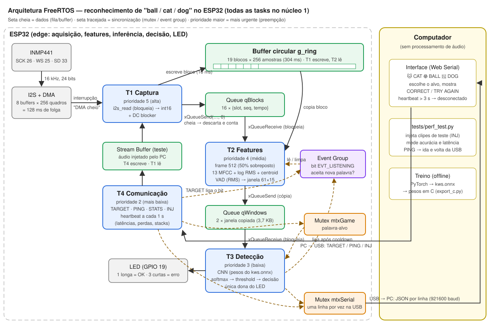

# Relatório Técnico: Detector Acústico de Palavras em Edge com ESP32 e FreeRTOS

**Ponderada:** Detector de Anomalias Acústicas
**Aplicação escolhida:** reconhecimento das palavras em inglês *ball*, *cat* e *dog* para um jogo educativo infantil.

> Convenção: todo número deste relatório vem de uma medição feita no projeto e
> indica a fonte. O que ainda não foi medido está marcado como **A SER MEDIDO**.

---

## 1. Problema

Crianças aprendendo inglês precisam de retorno imediato sobre a pronúncia de
palavras simples. Soluções baseadas em nuvem exigem internet, têm latência
variável e enviam a **voz de menores** para servidores de terceiros.

## 2. Justificativa

- **Detector acústico de eventos:** o sistema monitora um fluxo contínuo de
  áudio e dispara quando ocorre um evento de interesse: uma das três palavras.
  Todo o resto (silêncio, ruído, outras palavras) é o "fundo". Isso se encaixa
  na proposta da ponderada ("escolha livremente qual padrão acústico detectar").
  O limiar de confiança do modelo cumpre o papel de "alertar se > threshold".
- **Edge computing:** a inferência roda no ESP32. A voz da criança **nunca sai
  do dispositivo**; só o rótulo (`"cat"`) vai para o computador. Isso é bom para
  a privacidade (LGPD, dados de menores), funciona offline e tem latência
  previsível.
- **Baixo custo:** ESP32 + INMP441 + 1 LED.

## 3. Objetivo

Implementar, com FreeRTOS e no mínimo 3 tarefas sincronizadas, um sistema que:
captura áudio continuamente, extrai features (RMS, Spectral Centroid, MFCC),
classifica com um modelo treinado (exportado em `.onnx`), alerta por LED, envia
o resultado a uma interface, mede a latência de cada etapa e resolve os
conflitos de concorrência.

## 4. Arquitetura



### O que roda onde

| ESP32 (edge) | Computador |
|---|---|
| Captura I2S, buffer circular | Interface visual (`interface/index.html`) |
| Features (RMS, centroid, 13 MFCC) | Escolha da palavra-alvo |
| Detector de fala (VAD) e alinhamento da janela | Treino do modelo (offline, uma única vez) |
| **Inferência da CNN** | Scripts de teste de performance |
| Threshold, decisão, comparação com o alvo | |
| LED de alerta | |
| Protocolo JSON pela USB | |

### Fluxo de dados

```
INMP441 → I2S/DMA → T1 (captura) → buffer circular + fila qBlocks → T2 (features, VAD)
      → fila qWindows (janela 61×15 copiada) → T3 (CNN, decisão) → LED + JSON (USB) → interface
```

## 5. Hardware

| Componente | Ligação (GPIO) |
|---|---|
| ESP32-WROOM-32U (placa DevKit) | — |
| INMP441: VDD / GND / L/R | 3V3 / GND / GND |
| INMP441: SCK / WS / SD | 26 / 25 / 33 |
| LED + resistor (compatível, fornecido pelo lab) | 19 |

Detalhes, cuidados elétricos e testes isolados: [`hardware.md`](hardware.md).

**Ocorrências de montagem (documentadas por honestidade):**
- o LED verde queimou; o sistema passou a usar **um LED com dois padrões**
  (1 piscada longa = acerto, 3 curtas = erro);
- o botão foi removido do escopo por decisão de projeto: a rodada é iniciada
  pela interface.

## 6. Aquisição de áudio

- **I2S** em modo mestre (o ESP32 gera SCK = 1,024 MHz e WS = 16 kHz), 16 kHz,
  palavras de 32 bits com 24 bits úteis.
- **DMA:** 8 buffers × 256 quadros = **128 ms de folga** antes de perder áudio.
- **Leitura estéreo com escolha do slot.** Os modos mono do driver legado
  (`ONLY_LEFT`/`ONLY_RIGHT`) não entregaram o canal correto com o L/R no GND.
  O diagnóstico `SCAN` (firmware `recorder`) mediu o áudio no **slot 0**
  (−57 a −37 dBFS24 falando) e o slot 1 zerado. O firmware lê os dois slots e
  escolhe `AUDIO_MIC_SLOT = 0`.
- **Conversão:** `>> 8` (24 bits), filtro *DC blocker* (R = 0,995) e saturação
  em int16.
- **Calibração de ganho** (comando `LEVEL`, medida no hardware): com +18 dB a
  fala próxima saturava (pico 0,0 dBFS); com +6 dB o silêncio ficava em −44 a
  −50 dBFS e a fala com pico até −1,9 dBFS. Adotado **ganho 1×** para ter
  folga.
- O dataset foi gravado **pelo próprio INMP441**, com a mesma função de
  conversão do firmware final (`audio_io.cpp`), para eliminar a diferença de
  microfone entre treino e uso.

## 7. Processamento e features

Frames de 512 amostras (32 ms), janela de Hann, passo de 256 (16 ms), FFT de
512 pontos. Por frame (`kws_features.c`, espelhado em `training/features.py`):

| Feature | O que representa | Cálculo | Uso |
|---|---|---|---|
| **RMS** (`log10`) | energia/volume do frame | √(média de x²) | entrada do modelo **e** detector de fala (VAD) |
| **Spectral Centroid** (÷ 8 kHz) | "brilho": frequência média ponderada pela potência | Σ f·P(f) / Σ P(f) | entrada do modelo (ex.: /k/ e /t/ de *cat* são agudos) |
| **13 MFCC** | formato do espectro (qual som foi articulado) | potência → 40 filtros mel → log → DCT-II | entrada principal do modelo |

**Equivalência C × Python** (`tests/test_features.py`): 50 casos (sinais
sintéticos e WAVs reais) com erro máximo de **4,8·10⁻⁴** nos MFCC e
**1,7·10⁻⁶** no log RMS; o VAD dispara no mesmo frame nas duas versões.

**A entrada do modelo é uma janela de 61 frames × 15 features (~1 s).**

### Detecção de fala e alinhamento da janela
1. **VAD por energia:** a fala começa quando a energia fica > piso de ruído
   + 10 dB (e > −60 dBFS) por 2 frames. O piso é adaptativo: desce rápido e
   sobe devagar.
2. **Alinhamento pelo pico:** após o disparo, a T2 procura o frame de maior
   energia nos próximos 45 frames e posiciona a janela com esse pico no
   frame 15, a **mesma regra do treino**.

O alinhamento foi introduzido depois de um diagnóstico (seção 11.3): nas
gravações e no ambiente real, o VAD disparava em ruídos antes da palavra.

## 8. Modelo

| Item | Valor |
|---|---|
| Arquitetura | Normalização → Conv3×3(8) → ReLU → MaxPool → Conv3×3(16) → ReLU → MaxPool → Dense(32) → ReLU → Dense(5) → Softmax |
| Entrada | 1 × 61 × 15 (float32) |
| Saída | P(ball), P(cat), P(dog), P(unknown), P(noise) |
| Parâmetros | **24 485** (~96 KB em float32) |
| Custo | **331 000 MACs** por inferência |
| Arquivo | `model/kws.onnx` (99 869 bytes, opset 13) |

### Por que ONNX + C, e não um runtime ONNX no ESP32
Não há um runtime ONNX maduro para ESP32. O `.onnx` é a fonte da verdade:
`training/export_c.py` **valida o grafo** (13 operações esperadas) e extrai os
pesos do próprio `.onnx` para `kws_model_weights.h`. `kws_model.c` implementa
as mesmas 13 operações em C.

**Equivalência C × onnxruntime** (`tests/test_model_c.py`): 80 entradas,
diferença máxima de probabilidade de **2,4·10⁻⁶**, mesma classe em 80/80.
Alternativa considerada: TensorFlow Lite Micro, descartada por exigir uma
cadeia de conversão ONNX→TFLite frágil e por ser uma biblioteca "caixa-preta".

### Decisão (threshold e unknown)
- `noise` vence → **ignorado**: sem LED, o sistema volta a ouvir (ninguém falou).
- ball/cat/dog vence **e** confiança ≥ threshold → é a palavra.
- caso contrário → `unknown` (TRY AGAIN).

O threshold (**0,30**) foi escolhido maximizando o macro-F1 nas predições da
validação cruzada, **nunca** num conjunto usado no treino. Palavras fora do
vocabulário são tratadas por dois mecanismos: a classe `unknown` (45 palavras,
incluindo parecidas como *bowl*, *bat*, *doll* e traduções como *gato*) e o
threshold (sons nunca vistos).

## 9. Treinamento

### Dataset
Gravado pelo INMP441 com `tools/record_session.py`, em WAV PCM 16 bits, 16 kHz,
mono, 1,5 s por clipe.

| Classe | Clipes |
|---|---|
| ball / cat / dog | 100 / 100 / 100 |
| unknown | 150 |
| noise (tosse, palma, respiração, frases, silêncio + 35 de ambiente) | 85 |
| **Total** | **535** |

**Pessoas:** 3 vozes reais (p1 gravou 3 sessões, com voz normal, fina e grave;
p2 e p3 uma sessão cada), anonimizadas. As sessões de p1 **não** foram tratadas
como pessoas diferentes, porque isso vazaria a mesma voz entre treino e teste.

### Procedimento
- Janela alinhada pelo pico de energia (igual ao ESP32), com preenchimento de
  ruído de fundo antes e depois do clipe.
- *Augmentation* (6 versões por clipe): ganho ±6 dB, mistura com ruído dos
  ambientes gravados (SNR 5–25 dB) e deslocamento de ±6 frames.
- Adam (lr 2·10⁻³), 30 épocas, perda com peso por classe.
- **Validação leave-one-speaker-out:** para cada pessoa, treina com as outras e
  testa nela. Depois, o modelo final é treinado com todas.

## 10. FreeRTOS

### Tasks (todas fixadas no núcleo 1)

| Task | Prioridade | Função | Bloqueia em |
|---|---|---|---|
| T1 `capture` | 5 | I2S → buffer circular → `qBlocks` | `i2s_read` (DMA) |
| T2 `features` | 4 | RMS, centroid, MFCC, VAD, janela → `qWindows` | `xQueueReceive(qBlocks)` |
| T3 `detect` | 3 | CNN, decisão, LED, JSON | `xQueueReceive(qWindows)` |
| T4 `comm` | 2 | comandos do PC, heartbeat, injeção de teste | `vTaskDelay(10 ms)` |

**Por que no mesmo núcleo:** o ESP32 tem 2 núcleos. Com tasks em núcleos
diferentes, as prioridades nem competiriam. No mesmo núcleo, a preempção por
prioridade é efetiva: quando um bloco de áudio chega, a T1 interrompe a T2 ou
a T3 na hora.

**Por que a captura tem a prioridade mais alta:** o microfone não espera. Se a
T1 atrasar mais que a folga do DMA (128 ms), amostras são perdidas de forma
irreversível. Já um atraso de milissegundos na inferência é imperceptível.

### Sincronização

| Mecanismo | Quem envia → quem recebe | Problema resolvido |
|---|---|---|
| **Buffer circular** (19 blocos) + **Queue** `qBlocks` (16 índices) | T1 → T2 | Desacopla o ritmo da captura do processamento; a T2 dorme sem *polling*. O tamanho da fila (19 − 3) garante que a T1 nunca sobrescreve um bloco que a T2 ainda vai ler. |
| **Queue** `qWindows` (2 janelas, por **cópia**) | T2 → T3 | A T3 recebe uma cópia íntegra; a T2 continua escrevendo sem *race condition*. |
| **Event Group** `EVT_LISTENING` | T3/T4 ligam, T2 lê e limpa | Flag de estado segura entre tasks: não aceitar uma nova palavra enquanto o resultado é mostrado. |
| **Mutex** `mtxSerial` | T3, T4 | Linhas JSON inteiras na USB (sem mistura); herança de prioridade evita inversão. |
| **Mutex** `mtxGame` | T4 escreve o alvo, T3 lê | O alvo é um texto (não atômico); evita leitura durante a escrita. |
| **Stream Buffer** `sbInject` | T4 → T1 | Fluxo contínuo de bytes de áudio injetado pelo teste (1 escritor, 1 leitor). |
| LED **sem** mecanismo | só a T3 | Dono único, então não há conflito. |
| Contadores `g_stats` sem mutex | 1 escritor cada | Escrita de 32 bits alinhada é atômica no ESP32; o leitor (T4) tolera um valor de um instante antes. |

**Semáforo binário e Task Notification:** avaliados e **não usados**. O único
uso natural do semáforo (ISR do botão → task) saiu com o botão. Mecanismos não
foram adicionados só para cumprir requisito. O mutex do FreeRTOS é um semáforo
especial com herança de prioridade.

## 11. Concorrência e problemas evitados

| Problema | Como o projeto evita | Evidência medida |
|---|---|---|
| Perda de amostras | T1 com a maior prioridade; DMA com 128 ms de folga; T1 nunca bloqueia em fila (timeout 0) | `dma_gaps = 0`, `read_errors = 0` em 34 451 blocos (~9 min) |
| Buffer overflow | fila dimensionada por RING − 3; descarte contado (`ring_drops`) em vez de sobrescrita | `ring_drops = 0`, `seq_gaps = 0` |
| Race condition | janelas copiadas pela fila; alvo sob mutex; frame copiado do ring logo ao receber | — |
| Saída serial corrompida | `mtxSerial` por linha | — (linhas inválidas descartadas pelo PC: **A SER MEDIDO**) |
| Deadlock | nunca se segura dois mutexes ao mesmo tempo; seções críticas curtas | — |
| Inversão de prioridade | mutexes do FreeRTOS com herança de prioridade | — |
| Starvation | tasks de alta prioridade bloqueiam na maior parte do tempo (features: 710 µs a cada 16 ms ≈ 4,4% da CPU) | `feat_us_avg` ≈ 708–718 µs |
| Stack overflow | high-water mark reportado no heartbeat | bytes livres (mín., ~9 min de execução): capture 2396, features 5388, detect 2204, comm 3764 |

Uso de memória (compilação): flash **398 941 B (30%)**; RAM estática
**121 644 B (37%)**; heap livre em execução **185 644 B**.

### 11.3 Problemas encontrados e corrigidos (processo de engenharia)
1. **Canal do I2S:** o microfone "só funcionava com o L/R solto". O diagnóstico
   `SCAN` mostrou a causa (modos mono do driver). Solução: leitura estéreo +
   escolha de slot.
2. **Saturação:** ganho reduzido depois da medição com `LEVEL`.
3. **Acurácia inicial de 29%**, perto do acaso. Diagnóstico: com divisão
   aleatória, 93% no treino e 32% no teste. As janelas estavam desalinhadas
   porque o VAD disparava no **clique da tecla Enter** gravado no início dos
   clipes, e o preenchimento repetia trechos com fala. Com o alinhamento pelo
   pico, a divisão aleatória subiu para **82,7%**.
4. **Treino × ESP32:** a simulação do firmware com alinhamento só pelo VAD
   ignorava 267 de 505 eventos como ruído. Com a busca do pico também no
   ESP32, a simulação foi a **89,3%** nos mesmos dados.
5. **Ruído constante no LED:** o VAD disparava ~3×/s no ambiente real. A classe
   `noise` passou a ser ignorada, sem LED.

## 12. Latência

Medida com `esp_timer_get_time()` (µs) no ESP32 real
(`docs/results/perf_esp32_20260926_101547.md`, 30–50 eventos):

| Etapa | Início → fim | Mediana | p95 |
|---|---|---|---|
| Captura | DMA pronto → bloco convertido (T1) | **134 µs** | 154 µs |
| Fila T1→T2 | bloco pronto → T2 recebe | **26 µs** | 27 µs |
| Features | cálculo de 1 frame (T2) | **710 µs** | 729 µs |
| Fila T2→T3 | janela enviada → T3 recebe | **43 µs** | 43 µs |
| **Inferência** | `kws_model_run` (T3) | **32,2 ms** | 32,4 ms |
| Comunicação (envio) | escrita do JSON na USB | **2,67 ms** | 2,68 ms |
| Comunicação (ida e volta) | PING → PONG medido no PC | **47,1 ms** | 58,8 ms |
| **Resposta do sistema** | último bloco de áudio → LED aceso | **33,1 ms** | 33,2 ms |
| Resposta percebida | início da fala → LED aceso | **1,16 s** | 1,47 s |

**Análise:**
- O processamento por frame (~0,85 ms somando captura, fila e features) cabe
  com folga no período de 16 ms.
- A inferência domina o tempo depois do áudio (~97% dos 33 ms). Otimizações
  possíveis: quantização int8 ou ESP-NN.
- A resposta percebida (~1,2 s) é dominada pela **janela de ~1 s de áudio** e
  pela busca do pico (até 720 ms), e não pelo processamento. Reduzir a janela
  ou a busca diminuiria a latência, ao custo de contexto para o modelo.
- A ida e volta na USB (~47 ms) é dominada pelo sistema operacional do PC e
  pelo polling de 10 ms da T4. Ela não afeta o LED, que é local.
- Latência da interface (JSON recebido → tela atualizada): **A SER MEDIDO**.

## 13. Resultados e acurácia

### 13.1 Validação por pessoa real (estimativa honesta para voz nova)

| Configuração | Acurácia 5 classes | Decisão ball/cat/dog/unknown | Falso aceite* | Recall das palavras |
|---|---|---|---|---|
| **MFCC + RMS + Centroid** (final) | **0,474** | **0,514** | 0,205 | 0,327 |
| Só MFCC (ablação) | 0,434 | 0,502 | 0,155 | 0,273 |
| Por sessão (otimista: mesma voz vaza) | 0,596 | 0,626 | 0,245 | 0,540 |

\* Falso aceite: um som fora do vocabulário aceito como ball/cat/dog.

Por pessoa (5 classes): p1 0,400 · p2 0,640 · p3 0,530.

Matriz de confusão da decisão final (validação por pessoa):

| real \ previsto | ball | cat | dog | unknown |
|---|---|---|---|---|
| **ball** | 36 | 0 | 3 | 61 |
| **cat** | 0 | 40 | 1 | 59 |
| **dog** | 16 | 0 | 22 | 62 |
| **unknown** | 12 | 15 | 14 | 159 |

### 13.2 No ESP32 (pipeline completo, vozes do treino, portanto otimista)

- Simulação C no PC, 505 eventos: **0,893** (`docs/results/perf_offline_all_clips.md`)
- **ESP32 real, 50 eventos injetados: 0,820** (`docs/results/perf_esp32_20260926_101547.md`)

Esses números medem que o firmware reproduz o modelo no chip. **Não** medem
generalização.

### 13.3 Uso real (microfone ao vivo, crianças)
Acurácia com crianças falando ao vivo: **A SER MEDIDO**.

## 14. Limitações

- **Poucas vozes:** 3 pessoas reais (5 foram planejadas; houve cancelamentos),
  todas adultas. A generalização para crianças não foi medida.
- **Ambiente de coleta ruidoso e não estacionário** (ruído de fundo de −60 a
  −34 dB).
- **Artefatos da coleta:** clique da tecla no início dos clipes; parte das
  palavras cortadas no início (pessoas que falaram antes do LED acender).
- **O modelo é conservador:** erra mais mandando a palavra para `unknown` do
  que trocando uma palavra por outra.
- **VAD por energia simples:** em lugares barulhentos dispara com frequência
  (mitigado pela classe `noise`).
- Um único LED; sem feedback sonoro (buzzer opcional não usado).

## 15. Discussão

- A parte de **tempo real e concorrência** cumpriu o que foi proposto: zero
  perda de áudio em ~9 min, as tarefas com folga (features em ~4,4% da CPU) e
  resposta de ~33 ms após o áudio, tudo medido no chip.
- O fator limitante é o **dado**, não a arquitetura. A diferença entre a
  divisão aleatória (82,7%) e a validação por pessoa (47,4%) mostra que o
  modelo aprende bem as vozes que conhece, mas 3 vozes não bastam para
  generalizar.
- A **ablação** mostrou ganho com RMS + Centroid (+4 pontos na acurácia de 5
  classes); eles não entraram só para cumprir o requisito.
- **Testado e não adotado:** normalização por janela (CMN) deu +2,4 pontos,
  dentro da margem de erro com esses dados; mascaramento temporal não ajudou.
- Próximos passos com maior retorno: gravar mais vozes (principalmente de
  crianças), com o LED de "fale agora" mais longo e o teclado longe do
  microfone; depois, quantização int8 para reduzir os 32 ms de inferência.

## 16. Conclusão

O projeto entrega um sistema embarcado completo e medido. O ESP32 captura áudio
continuamente pelo INMP441, extrai RMS, Spectral Centroid e MFCC, executa uma
CNN (exportada em `.onnx` e verificada bit a bit contra o `onnxruntime`),
decide com threshold e classe `unknown`, alerta pelo LED e envia o resultado a
uma interface infantil. Tudo isso em 4 tasks FreeRTOS sincronizadas por filas,
mutexes, event group e stream buffer. As latências de cada etapa foram medidas
no hardware. A acurácia para vozes novas (≈ 51% na decisão final) é limitada
pelo tamanho do dataset e foi reportada com validação por pessoa, sem vazamento
entre treino e teste.

---

### Entregáveis

| Entregável | Local |
|---|---|
| Código-fonte | `firmware/`, `training/`, `interface/`, `tools/` |
| Diagrama RTOS | `docs/rtos_diagram.svg` |
| Modelo `.onnx` | `model/kws.onnx` |
| Relatório técnico | este arquivo |
| Código de teste | `tests/perf_test.py` (injeta eventos no ESP32 e mede acurácia e latência), `tests/test_features.py`, `tests/test_model_c.py` |
